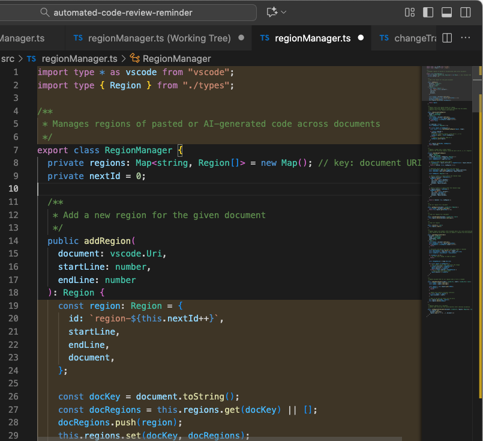

# Paste Review Reminder

Never forget to review code pasted from other sources (like genAI), or AI streamed directly in file.

**VS Code Extension** – Reminds you to review pasted or AI-generated code blocks across your workspace, allowing tracking and highlighting of these blocks per file.

---

## Screenshot

Here's how Paste Review Reminder highlights areas for review in your editor:



---

## Features

- **Code Block Tracking:** Automatically tracks pasted or AI-generated code blocks in your workspace.
- **Decorations:** Highlights tracked blocks in the editor for quick identification.
- **Line Change Awareness:** Lines are un-highlighted when touched (clicked, selected).
- **Per-File Storage:** Saves blocks per file to file (`.pastereview.json`), allowing Git versioning.
- **Checksum Validation:** Ensures saved blocks correspond to the current file content.
- **Git-Friendly:** The saved manifest can be committed to source control.

---

## Block Tracking Logic

The extension uses two distinct paths to determine whether a change constitutes a block of code requiring review:

### 1. Direct Paste Detection

This path detects a single, large content change that occurs instantly, which is characteristic of a **manual paste** operation.

- If a single text change introduces more than the number of lines set by **`pasteReviewReminder.minimumPasteLines`** (default: 20 lines), the block is **immediately tracked and highlighted**.

### 2. Fast Typing / Streaming AI Detection

This path tracks continuous, rapid changes over a short duration, which is characteristic of **AI code generation streaming**.

- The extension tracks the total number of characters added and the duration of continuous typing activity.
- If, after a brief pause (100ms timeout), **BOTH** conditions are met, the block is tracked:
  - **Speed:** The calculated typing speed exceeds the **`pasteReviewReminder.typingSpeedThreshold`** (default: 110 characters/sec).
  - **Size:** The total number of affected lines exceeds the **`pasteReviewReminder.minimumStreamingLines`** (default: 20 lines).

---

## Usage

1. Paste or generate code in your files.
2. The extension automatically tracks the new blocks.
3. Tracked blocks are highlighted in the editor.
4. Touched lines are unhighlighted.

---

## Development & Installation

For manual installation or testing a built VSIX package:

### 1. Build the VSIX Package

To build the distributable `.vsix` file, you need Node.js and the VS Code Extension Manager (`vsce`) installed globally.

1.  **Install `vsce` (if necessary):**
    ```bash
    npm install -g vsce
    ```
2.  **Compile TypeScript and Build:**
    Run the following command from the root of the project directory. This executes the `vscode:prepublish` script defined in your `package.json` (which runs `npm run compile`) and then packages the result.
    ```bash
    vsce package
    ```
    This command will generate a file named similarly to `paste-review-reminder-0.0.1.vsix` in your project root.

### 2. Install the Extension from VSIX

Once the `.vsix` file is built, you can install it into VS Code without going through the Marketplace.

#### **Method A: Using the VS Code GUI (Recommended)**

1.  Open VS Code.
2.  Go to the **Extensions** view (`Ctrl+Shift+X` or `Cmd+Shift+X`).
3.  Click the **`...`** (More Actions) menu in the top-right of the Extensions panel.
4.  Select **`Install from VSIX...`**.
5.  Navigate to your project root and select the built `.vsix` file.
6.  Click **Reload** when prompted to activate the extension.

#### **Method B: Using the Command Line**

1.  Open your terminal.
2.  Run the VS Code command, pointing to the built file:
    ```bash
    code --install-extension /path/to/paste-review-reminder-0.0.1.vsix
    ```
3.  Open the VS Code Command Palette (`Ctrl+Shift+P` or `Cmd+Shift+P`) and run **`Developer: Reload Window`** to activate the extension.

---

## Storage

- Manifest file: `.pastereview.json` (workspace root)
- Stores per-file blocks with checksums to detect content changes.

---

## Configuration

You can customize the extension via **Settings** (`Cmd+,` on Mac, `Ctrl+,` on Windows/Linux) under **Paste Review Reminder**. Available configuration options:

- **Minimum Paste Lines (`pasteReviewReminder.minimumPasteLines`)** Minimum number of lines in a paste to trigger block highlighting. Default: `20`.

- **Minimum Streaming Lines (`pasteReviewReminder.minimumStreamingLines`)** Minimum number of lines typed quickly (or streamed from AI completions) to trigger block highlighting. Default: `20`.

- **Typing Speed Threshold (`pasteReviewReminder.typingSpeedThreshold`)** Characters per second threshold to detect fast typing for AI completions. Default: `110`.

- **Highlight Color (`pasteReviewReminder.highlightColor`)** Background color used to highlight blocks. Default: `rgba(255, 200, 100, 0.15)`.
